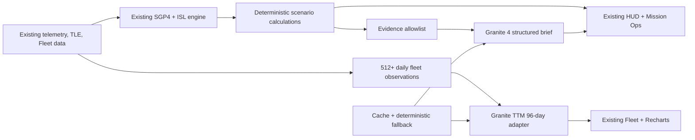

# LEO Sentinel

LEO Sentinel turns an existing, production-quality Starlink visualization into
a mission-resilience copilot for LEO operators. It preserves the original 3D
globe, Sky view, Fleet analytics, SGP4 propagation, dish telemetry, handoffs,
ground stations, and ISL routing, then adds outage simulation, a 96-day IBM
Granite fleet outlook, and evidence-grounded mission briefs.

This is the August IBM AI Builders Challenge submission for the **Advance Space Exploration with AI** theme:

- **Public demo:** [leo-sentinel.vercel.app](https://leo-sentinel.vercel.app)
- **Three-minute video:** [Watch the 2:28 submission video](https://youtu.be/GyvoJHHyz_g)
- **Submission repository:** [jawaharlaldoon-bit/leo-sentinel](https://github.com/jawaharlaldoon-bit/leo-sentinel)

## The problem

LEO operators have abundant telemetry but little time to understand what an
asset outage changes, whether an alternate path exists, how fleet health is
trending, and which response is supported by evidence. Open-ended chat is a
poor fit for this workflow: mission decisions need bounded inputs, repeatable
calculations, source labels, and graceful operation when AI is unavailable.

## The solution

Mission Ops adds three predefined workflows to the existing HUD:

- **North Atlantic gateway outage** — isolates the closest gateway and tests an
  alternate route through Goonhilly.
- **Polar-shell degradation** — removes a polar asset and measures an ISL-style
  alternate path.
- **Fleet anomaly watch** — isolates an anomalous asset while preserving a
  route when redundancy exists.

Every run returns baseline/degraded routes, latency and hop deltas, disabled
assets, a deterministic risk score, and individually identified evidence. The
mission brief can only cite those evidence IDs; unsupported claims are rejected.

The Fleet page adds a **96-day forecast** for operational, ISL-capable,
orbit-raising, deorbiting, and anomalous satellites, using at least 512 daily
observations. It displays MAE, MAPE, and a naïve-baseline comparison.

## What existed and what is new

| Existing upstream engine, preserved | August challenge additions |
|---|---|
| Next.js/React application | LEO Sentinel branding and Mission Ops workflow |
| React Three Fiber/Three.js globe | Three deterministic resilience scenarios |
| Space and Sky views | Typed `/api/scenarios/run` endpoint |
| SGP4 propagation and TLE loading | Granite TTM 512/96 forecast adapter |
| ISL routing and route beams | Forecast cache, backtest, and bundled result |
| Ground stations and PoP logic | Granite 4 grounded mission briefs |
| Dish telemetry, WebSockets, handoffs | Evidence validation, rate limits, retries, fallbacks |
| Fleet Parquet/DuckDB/Recharts analytics | Health endpoint and zero-cost guardrails |
| Docker packaging and port `7860` runner | IBM Bob evidence and zero-cost release workflow |

Legal notices, project attribution, and submission contributions are collected
in [docs/legal-and-contributions](docs/legal-and-contributions/README.md). The
canonical [MIT license](LICENSE) remains at the repository root so GitHub and
package tooling can detect it.

## IBM technology

- **IBM Bob** is the required primary development environment. Focused prompts,
  validation, commits, and screenshot requirements are in
  [IBM_BOB_USAGE.md](IBM_BOB_USAGE.md).
- **`ibm/granite-ttm-512-96-r2`** is the configured time-series model. Live
  forecast refresh is development/admin-only; the public demo uses a labeled
  cache when refresh is not authorized.
- **`ibm/granite-4-h-small`** generates structured mission briefs through
  watsonx.ai Runtime Lite. Temperature is zero, output is schema-checked, every
  finding requires valid evidence IDs, malformed output is retried once, and a
  deterministic grounded brief is always available.

## Architecture



All IBM credentials remain server-side. API bodies are capped at 64 KB, IAM
tokens are cached, upstream calls time out after 20 seconds and retry once,
and in-memory rate limits protect the free allowance. AI failures never stop
the globe, telemetry, routing, or Fleet views.

## Zero-cost architecture

The application requires no paid infrastructure:

- public Next.js deployment on **Vercel Hobby ($0)** with hard free-tier caps;
- `DEMO_MODE=true` for judges, with the existing Docker image and port `7860`
  retained and release-tested for portable deployment;
- watsonx.ai **Runtime Lite only**, with credentials stored as server-side
  Vercel environment variables;
- no IBM Code Engine, paid Hugging Face plan/hardware/storage, database, vector store,
  monitoring vendor, domain, or paid API;
- cached forecast and deterministic brief when IBM is disabled, timed out,
  unauthenticated, rate-limited, or out of free allowance.

Hugging Face changed its policy in July 2026 so creating a new Gradio or Docker
Space requires a paid subscription even on CPU Basic. LEO Sentinel therefore
uses Vercel Hobby for the public demo rather than violating the zero-cost
constraint. The Docker deployment remains part of the repository and was
validated locally on port `7860`.

`WATSONX_LIVE_ENABLED=false` is the safe default. No user interaction can
activate a paid plan or create billable infrastructure.

## Run locally

Requirements: Node.js 22 and Git LFS.

```powershell
git lfs pull
npm ci
Copy-Item .env.example .env.local
npm run dev
```

Open `http://localhost:3000`. No physical dish is required; demo telemetry is
enabled by default. Open `/fleet` for the forecast.

To enable live IBM inference, create a watsonx.ai Runtime Lite project, confirm
the account is still on Lite, place credentials only in `.env.local`, and set
`WATSONX_LIVE_ENABLED=true`. Never place the API key in a `NEXT_PUBLIC_*`
variable. Production forecast refresh additionally requires the private
`x-forecast-refresh-token` header.

## APIs

| Endpoint | Purpose |
|---|---|
| `GET /api/health` | Demo, IBM, cache, model, and cost-guardrail status |
| `POST /api/scenarios/run` | Typed deterministic outage calculation |
| `POST /api/ai/forecast` | Cached/bundled/live 512-to-96 fleet forecast |
| `POST /api/ai/brief` | Evidence-grounded Granite or deterministic brief |

## Validation

```powershell
npm test
npx tsc --noEmit
npm run build
docker build -t leo-sentinel .
docker run --rm -p 7860:7860 --env-file .env.local leo-sentinel
```

Tests cover existing behavior plus gateway/satellite removal, successful and
failed rerouting, multiple disabled assets, deterministic scoring, 512-point
validation, forecast cache and backtesting, brief schema and evidence IDs,
malformed Granite output, IAM failure, timeout, quota exhaustion, and fallback
behavior.

## Data and limitations

- Orbital elements: CelesTrak/Space-Track-derived public TLE sources used by the
  upstream project.
- Ground stations: the existing public Hugging Face ground-station dataset and
  FCC/international filing research.
- Fleet history: the existing Hugging Face Parquet dataset; a clearly labeled
  deterministic demo cache is used when it is not mounted.
- Scenario topology and risk are simulations for decision support, not commands
  to a live constellation.
- Forecasts are fleet trends, not orbital propagation predictions.
- Mission briefs are constrained summaries and require operator review.

## Team and submission

**Sole challenge entrant and current maintainer:**
[Jawahar (`jawaharlaldoon-bit`)](https://github.com/jawaharlaldoon-bit).

IBM Bob prompts, outcomes, validation, and screenshots are recorded in
[IBM_BOB_USAGE.md](IBM_BOB_USAGE.md). Team roles and challenge work are recorded
in the consolidated
[contribution record](docs/legal-and-contributions/CONTRIBUTIONS.md). Before
submitting, Jawahar completed the required SkillsBuild activity personally; the
[completion evidence](docs/bob-evidence/05-skillsbuild-completed.png) is retained with the submission materials. The final operational checklist and exact video timeline are in
[docs/SUBMISSION_CHECKLIST.md](docs/SUBMISSION_CHECKLIST.md).

## License

MIT. The required copyright notice and permission terms are preserved in the
canonical [LICENSE](LICENSE). Attribution and contribution details are grouped
under [docs/legal-and-contributions](docs/legal-and-contributions/README.md).
